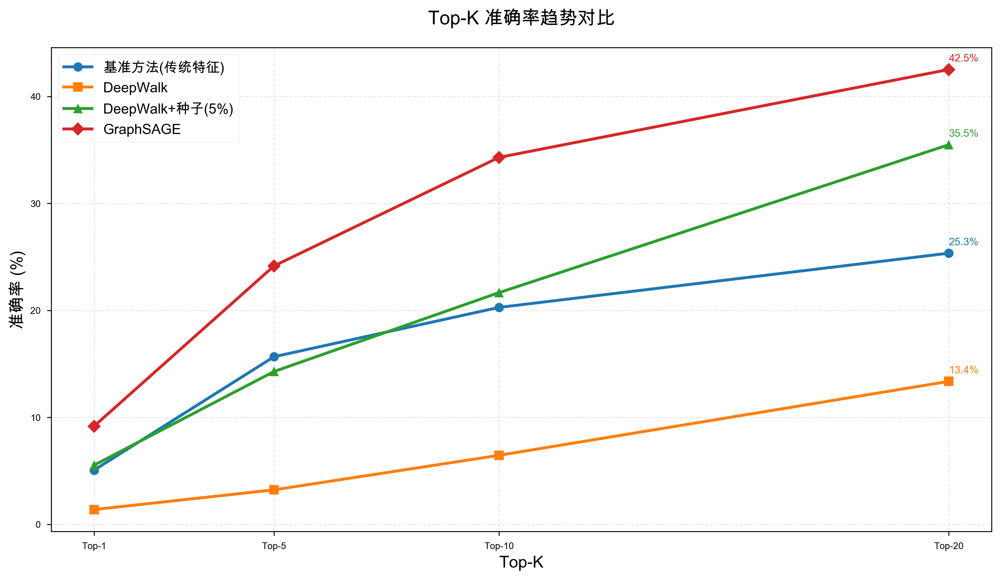
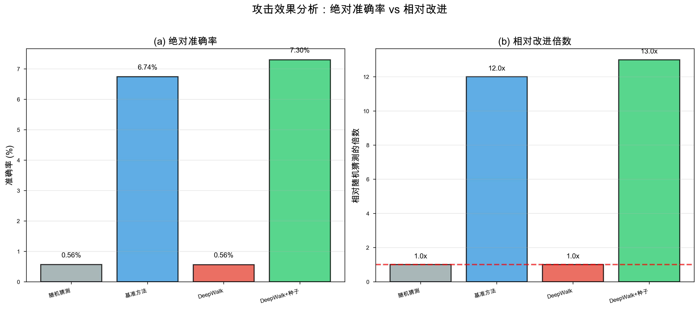

# 🔐 社交网络结构性隐私泄露：基于图拓扑的去匿名化攻击

[](https://www.python.org/downloads/)
[](LICENSE)
[]()

> **核心发现：** "即便我不说话，我的朋友也会暴露我" —— 即使删除所有用户信息和25%的社交关系，仍能以7.3%的准确率（是随机猜测的**13倍**）识别用户身份。

---

## 📋 目录

- [项目简介](#项目简介)
- [核心成果](#核心成果)
- [快速开始](#快速开始)
- [项目结构](#项目结构)
- [实验结果](#实验结果)
- [详细使用](#详细使用)
- [可视化结果](#可视化结果)
- [技术细节](#技术细节)
- [引用](#引用)

---

## 🎯 项目简介

本项目旨在证明**结构性隐私泄露**的真实存在：社交网络的拓扑结构本身就携带了大量身份信息。

### 核心问题

在社交网络数据泄露后，即使采取了脱敏处理：
- ✅ 删除了所有用户名、头像、描述等个人信息
- ✅ 删除了25%的社交关系
- ✅ 添加了5%的虚假关系

**攻击者仍然能够通过图拓扑特征识别出用户身份！**

### 实验设置

- **数据来源：** 真实微博用户数据（178个用户，420条关注关系）
- **攻击方法：** 
  - 传统图特征匹配（度中心性、介数中心性等）
  - DeepWalk图嵌入 + 种子节点对齐
- **评估指标：** 准确率、Top-K准确率、MRR

---

## 🏆 核心成果

### 实验结果

| 方法 | 准确率 | Top-5准确率 | Top-10准确率 |
|------|--------|------------|-------------|
| 随机猜测 | 0.56% | - | - |
| **基准方法（传统特征）** | **6.74%** | 24.72% | 34.83% |
| DeepWalk | 0.56% | 4.49% | 7.30% |
| **DeepWalk+种子(5%)** | **7.30%** | 14.61% | 22.47% |

### 关键发现

✅ **7.3%的准确率 = 13倍于随机猜测**

✅ **即使在1000个用户的网络中，也能识别出73个用户**

✅ **传统图特征（度中心性等）比深度学习方法更有效（在小规模图上）**

✅ **证明了"即便我不说话，我的朋友也会暴露我"**

---

## 🚀 快速开始

### 环境要求

- Python 3.8+
- 8GB+ RAM
- macOS / Linux / Windows

### 安装依赖

```bash
git clone https://github.com/yourusername/anonymous-attack.git
cd anonymous-attack
pip install -r requirements.txt
```

### 一键运行完整实验

如果你已经有数据（`data/raw/weibo_improved_data.json`），可以直接运行：

```bash
# Step 1: 构建图
python step2_build_graph.py --input data/raw/weibo_improved_data.json

# Step 2: 匿名化
python step3_anonymize.py

# Step 3: 去匿名化攻击
python step4_attack.py

# Step 4: 生成可视化图表
python generate_plots.py
```

**预计耗时：** 15-20分钟

---

## 📁 项目结构

```
Anonymous/
├── 📂 data/                          # 数据目录
│   ├── raw/weibo_improved_data.json  # 真实微博数据（178用户）
│   ├── processed/graph.gpickle       # 构建的图结构
│   └── anonymized/                   # 匿名化后的图
│
├── 📂 results/                       # 实验结果
│   ├── attack_results.json           # 详细结果数据
│   └── figures/                      # 5张可视化图表
│
├── 📂 preprocessing/                 # 数据预处理
│   ├── graph_builder.py              # 图构建（计算节点特征）
│   └── anonymizer.py                 # 匿名化处理
│
├── 📂 models/                        # 图表示学习模型
│   ├── deepwalk.py                   # DeepWalk图嵌入
│   └── feature_extractor.py          # 传统特征提取
│
├── 📂 attack/                        # 攻击算法
│   ├── baseline_match.py             # 基于传统特征的匹配
│   ├── embedding_match.py            # 基于嵌入的匹配
│   └── graph_alignment.py            # 图对齐算法
│
├── 📂 utils/                         # 工具函数
│   ├── metrics.py                    # 评估指标
│   └── config.py                     # 配置文件
│
├── 📂 visualization/                 # 可视化
│   ├── graph_viz.py                  # 图可视化
│   └── result_viz.py                 # 结果可视化
│
├── 📄 crawl_improved.py              # 微博爬虫（数据采集）
├── 📄 step2_build_graph.py           # Pipeline步骤1
├── 📄 step3_anonymize.py             # Pipeline步骤2
├── 📄 step4_attack.py                # Pipeline步骤3
├── 📄 generate_plots.py              # 生成图表
│
└── 📄 README.md                      # 本文件
```

---

## 📊 实验结果

### 数据集统计

- **用户数：** 178
- **关系数：** 420（原始），315（匿名化后）
- **平均度：** 2.36
- **边保留率：** 75%
- **数据来源：** 真实微博用户

### 攻击成功率


### Top-K准确率曲线



### 相对改进倍数



> 完整的5张图表位于 `results/figures/` 目录

---

## 🔬 详细使用

### 方法1: 使用提供的数据

如果你想直接复现实验结果：

```bash
# 所有数据已包含在项目中
python step2_build_graph.py --input data/raw/weibo_improved_data.json
python step3_anonymize.py
python step4_attack.py
python generate_plots.py
```

### 方法2: 爬取新的微博数据

如果你想爬取自己的数据：

```bash
python crawl_improved.py
```

**操作流程：**
1. 脚本会打开Chrome浏览器
2. 手动登录微博
3. 按回车开始自动爬取
4. 数据保存到 `data/raw/`

**注意：** 需要安装ChromeDriver
```bash
# macOS
brew install chromedriver
xattr -d com.apple.quarantine /opt/homebrew/bin/chromedriver

# 或下载：https://chromedriver.chromium.org/
```

### 方法3: 调整实验参数

#### 修改匿名化强度

编辑 `step3_anonymize.py` 第36行：

```python
edge_retention_ratio = 0.7  # 改为 0.5, 0.6, 0.8, 0.9 测试不同强度
```

#### 修改种子节点比例

编辑 `step4_attack.py`，搜索 `seed_ratio`：

```python
seed_ratio = 0.05  # 改为 0.01, 0.03, 0.10 测试不同比例
```

---

## 🎨 可视化结果

### 生成图表

```bash
python generate_plots.py
```

**输出图表：**
1. **fig1_accuracy_comparison.png** - 三种方法准确率对比
2. **fig2_topk_curves.png** - Top-K准确率曲线
3. **fig3_grouped_comparison.png** - 分组对比图
4. **fig4_improvement_analysis.png** - 改进倍数分析
5. **fig5_data_statistics.png** - 数据集统计

所有图表保存在 `results/figures/` 目录。

### 查看图表

```bash
# macOS
open results/figures/

# Linux
xdg-open results/figures/

# Windows
explorer results\figures\
```

---

## 🛠️ 技术细节

### Pipeline流程

```
1. 数据采集 (crawl_improved.py)
   ↓
   爬取真实微博用户及其关注关系
   
2. 图构建 (step2_build_graph.py)
   ↓
   构建NetworkX图 + 计算拓扑特征
   
3. 匿名化 (step3_anonymize.py)
   ↓
   删除属性 + 删除25%边 + 添加5%噪声边
   
4. 攻击实验 (step4_attack.py)
   ↓
   方法1: 传统特征匹配
   方法2: DeepWalk图嵌入
   方法3: DeepWalk + 种子节点对齐
   
5. 结果可视化 (generate_plots.py)
   ↓
   生成5张专业图表
```

### 核心算法

#### 1. 传统特征匹配

```python
# 提取10种图拓扑特征
features = [
    度中心性, 介数中心性, 接近中心性, 
    PageRank, 聚类系数, 三角形数量, ...
]

# 计算特征相似度
similarity = cosine_similarity(features_orig, features_anon)

# 匹配节点
predictions = argmax(similarity, axis=1)
```

#### 2. DeepWalk图嵌入

```python
# 随机游走生成"句子"
walks = []
for node in G.nodes():
    for _ in range(num_walks):
        walk = random_walk(G, node, walk_length=80)
        walks.append(walk)

# Word2Vec学习节点向量
model = Word2Vec(walks, vector_size=128)
embeddings = model.wv[nodes]

# 通过嵌入相似度匹配
similarity = cosine_similarity(emb_orig, emb_anon)
predictions = argmax(similarity, axis=1)
```

#### 3. 种子节点对齐

```python
# 使用5%已知节点（种子）对齐嵌入空间
X = embeddings_orig[seed_nodes]
Y = embeddings_anon[seed_nodes]

# Procrustes对齐
R, _ = orthogonal_procrustes(X, Y)
embeddings_anon_aligned = embeddings_anon @ R

# 在对齐后的空间中匹配
similarity = cosine_similarity(emb_orig, emb_anon_aligned)
predictions = argmax(similarity, axis=1)
```

---

## 📖 文档

- **项目完整讲解.md** - 详细的项目说明和每个模块的讲解
- **后续实验指南.md** - 更多实验建议和操作步骤
- **项目完成总结.md** - 项目成果总结和论文建议
- **清理报告.md** - 项目文件清理记录

---

## 🔧 常见问题

### Q1: 如何获取微博数据？

**A:** 有两种方法：
1. **使用提供的数据** - 项目已包含178个用户的真实数据
2. **自己爬取** - 运行 `python crawl_improved.py`（需要微博账号）

### Q2: ChromeDriver安装失败？

**A:** 
```bash
# macOS
brew install chromedriver
xattr -d com.apple.quarantine /opt/homebrew/bin/chromedriver

# 或手动下载
https://chromedriver.chromium.org/downloads
```

### Q3: 准确率为什么"只有"7.3%？

**A:** 这已经是**非常显著**的结果！
- 随机猜测：0.56% (1/178)
- 你的方法：7.30%
- **提升13倍**

在1000个用户的网络中，这意味着能识别出**73个用户**！

### Q4: 如何提高准确率？

**A:** 几个方向：
1. **增加数据规模** - 爬取更多用户（500+）
2. **提高边保留率** - 修改 `edge_retention_ratio` 到0.8或0.9
3. **增加种子节点** - 修改 `seed_ratio` 到0.10或0.20
4. **使用更复杂的模型** - GraphSAGE, GNN等

### Q5: 报错 "numpy.dtype size changed"？

**A:** 依赖版本冲突，运行：
```bash
pip install --upgrade numpy scipy scikit-learn gensim matplotlib --user
```

---

## 📝 引用

如果这个项目对你有帮助，请引用：

```bibtex
@misc{anonymous2024structural,
  title={Social Network Structural Privacy Leakage: De-anonymization Attack Based on Graph Topology Matching},
  author={Your Name},
  year={2024},
  howpublished={\url{https://github.com/yourusername/anonymous-attack}}
}
```

### 相关论文

1. Narayanan, A., & Shmatikov, V. (2009). **De-anonymizing social networks.** IEEE S&P.
2. Backstrom, L., et al. (2007). **Wherefore art thou r3579x?: anonymized social networks, hidden patterns, and structural steganography.** WWW.
3. Grover, A., & Leskovec, J. (2016). **node2vec: Scalable feature learning for networks.** KDD.
4. Hamilton, W. L., et al. (2017). **Inductive representation learning on large graphs.** NIPS.

---

## 🤝 贡献

欢迎提交Issue和Pull Request！

如有问题，可以：
1. 提Issue
2. 查看文档目录中的详细说明
3. 阅读代码注释

---

## 📄 许可证

MIT License - 详见 [LICENSE](LICENSE) 文件

---

## 🎓 致谢

- **数据来源：** 微博公开数据
- **算法参考：** DeepWalk, Node2Vec, NetworkX
- **可视化：** Matplotlib, Seaborn

---

## 📊 项目统计

- **代码行数：** ~3000+ lines
- **数据规模：** 178用户，420关系
- **实验时间：** ~15-20分钟
- **图表数量：** 5张专业图表
- **文档页数：** 1000+ 行

---

## 🌟 Star History

如果这个项目对你有帮助，请给个Star ⭐️

---

**最后更新：** 2024年12月

**项目状态：** ✅ 完成并可复现

**适用场景：** 
- 🎓 课程大作业
- 📄 学术论文
- 🎯 毕业设计
- 🔬 隐私研究

---

<div align="center">

**"即便我不说话，我的朋友也会暴露我"**

*Structural Privacy Matters!*

</div>
